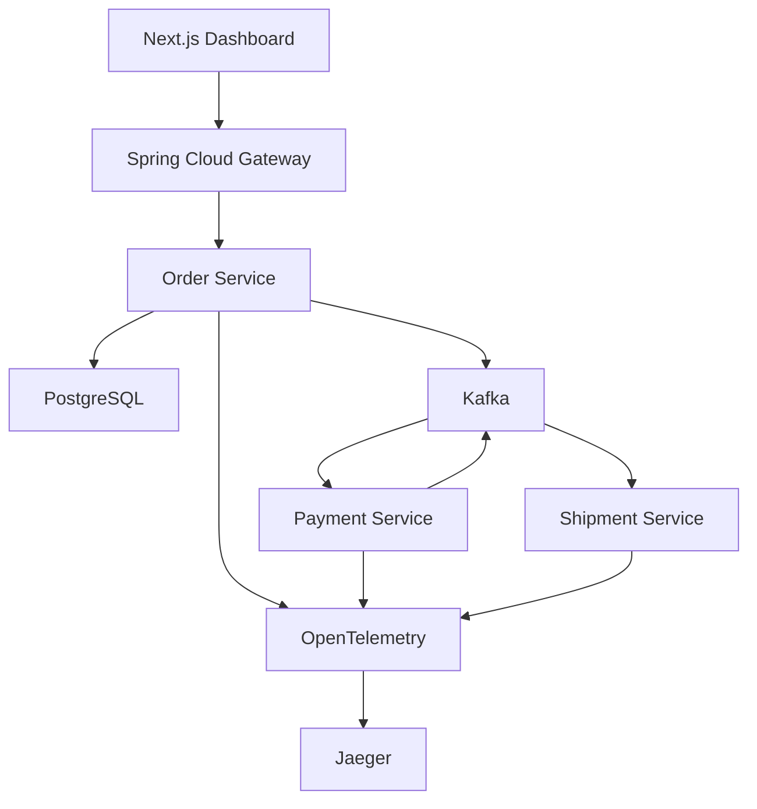

# FlowForge

FlowForge is an event-driven order-processing system built with Java 21 and Spring Boot. It accepts an order, validates and persists it, and coordinates payment and shipment through Kafka events until the order reaches its final state.

The project demonstrates asynchronous microservice communication, transactional outbox processing, API design, distributed tracing, and containerized local development.

## Architecture



The platform contains four backend components:

* **Gateway:** Routes incoming requests to the appropriate service and propagates correlation IDs.
* **Order Service:** Provides REST and GraphQL APIs, validates orders through Apache Camel, and stores orders and timeline events in PostgreSQL.
* **Payment Service:** Consumes newly created orders and publishes payment-completed events.
* **Shipment Service:** Consumes payment events and publishes shipment-completed events.

A Next.js dashboard provides a simple interface for creating orders and following their progress.

## Order Lifecycle

A physical order moves through the following states:

```text
CREATED → VALIDATED → PAYMENT_PENDING → PAID → SHIPMENT_PENDING → SHIPPED
```

Digital orders complete after payment and do not enter the shipment workflow.

## Technology Stack

### Backend

* Java 21
* Spring Boot
* Spring Cloud Gateway
* Apache Camel
* Spring GraphQL
* Spring Kafka
* Spring Data JPA
* PostgreSQL
* Flyway

### Frontend

* Next.js
* React
* TypeScript

### Infrastructure and Observability

* Docker Compose
* Apache Kafka
* OpenTelemetry
* Jaeger
* GitHub Actions
* OpenAPI/Swagger

## Key Features

* REST endpoint for creating orders
* GraphQL API for retrieving orders and timeline events
* Apache Camel validation and routing
* Transactional outbox pattern for reliable event publication
* Kafka-based payment and shipment workflows
* PostgreSQL persistence with Flyway migrations
* Correlation IDs across gateway and backend services
* Distributed tracing with OpenTelemetry and Jaeger
* OpenAPI documentation
* Dockerized local environment
* Automated CI checks with GitHub Actions

## Running the Project

### Prerequisites

Install the following before starting:

* Java 21
* Docker and Docker Compose
* Node.js 20 or later

### Start the Full Stack

From the project root, run:

```bash
docker compose up --build
```

After the containers start, the following services will be available:

| Service     | URL                                   |
| ----------- | ------------------------------------- |
| Dashboard   | http://localhost:3000                 |
| API Gateway | http://localhost:8080                 |
| Swagger UI  | http://localhost:8080/swagger-ui.html |
| GraphiQL    | http://localhost:8080/graphiql        |
| Jaeger      | http://localhost:16686                |

## Creating an Order

An order can be created through the dashboard or with the REST API:

```bash
curl -X POST http://localhost:8080/api/orders \
  -H "Content-Type: application/json" \
  -d '{
    "customerId": "cust-42",
    "fulfillmentType": "PHYSICAL",
    "items": [
      {
        "sku": "SKU-100",
        "quantity": 2,
        "unitPrice": 19.99
      }
    ]
  }'
```

The response contains the generated order ID. The order can then be retrieved through GraphQL:

```graphql
query {
  order(id: "ORDER_ID") {
    id
    customerId
    status
    timeline {
      status
      message
      occurredAt
    }
  }
}
```

## Event Flow

1. The gateway forwards the order request to the Order Service.
2. Apache Camel validates the request.
3. The order and its outbox event are stored in PostgreSQL.
4. The outbox publisher sends an `ORDER_CREATED` event to Kafka.
5. The Payment Service processes the event and publishes `PAYMENT_COMPLETED`.
6. The Shipment Service processes the payment event and publishes `SHIPMENT_COMPLETED`.
7. The Order Service updates the order status and timeline as each event arrives.

## Testing

Run the Order Service tests from the repository root:

```bash
./mvnw -pl order-service -am test
```

## Project Structure

```text
flowforge-order-orchestration/
├── gateway/              # Spring Cloud API Gateway
├── order-service/        # Order APIs, persistence, Camel routes, and outbox
├── payment-service/      # Kafka payment consumer
├── shipment-service/     # Kafka shipment consumer
├── platform/             # Shared domain events and enums
├── web/                  # Next.js operations dashboard
├── deploy/               # Deployment configuration
├── compose.yaml          # Local infrastructure and services
└── pom.xml               # Parent Maven configuration
```

## Deployment

The Next.js dashboard can be deployed separately on Vercel using `web` as the project root.

AWS ECS/Fargate configuration is currently under development. The files in `deploy/ecs` are starter deployment definitions and do not represent a live production deployment.

## Future Improvements

* Deploy the backend services to AWS ECS/Fargate
* Add authentication and role-based access control
* Introduce retry topics and dead-letter queues
* Add idempotency keys for order creation
* Add failure and compensation paths to the order saga
* Export production telemetry to a managed observability platform
