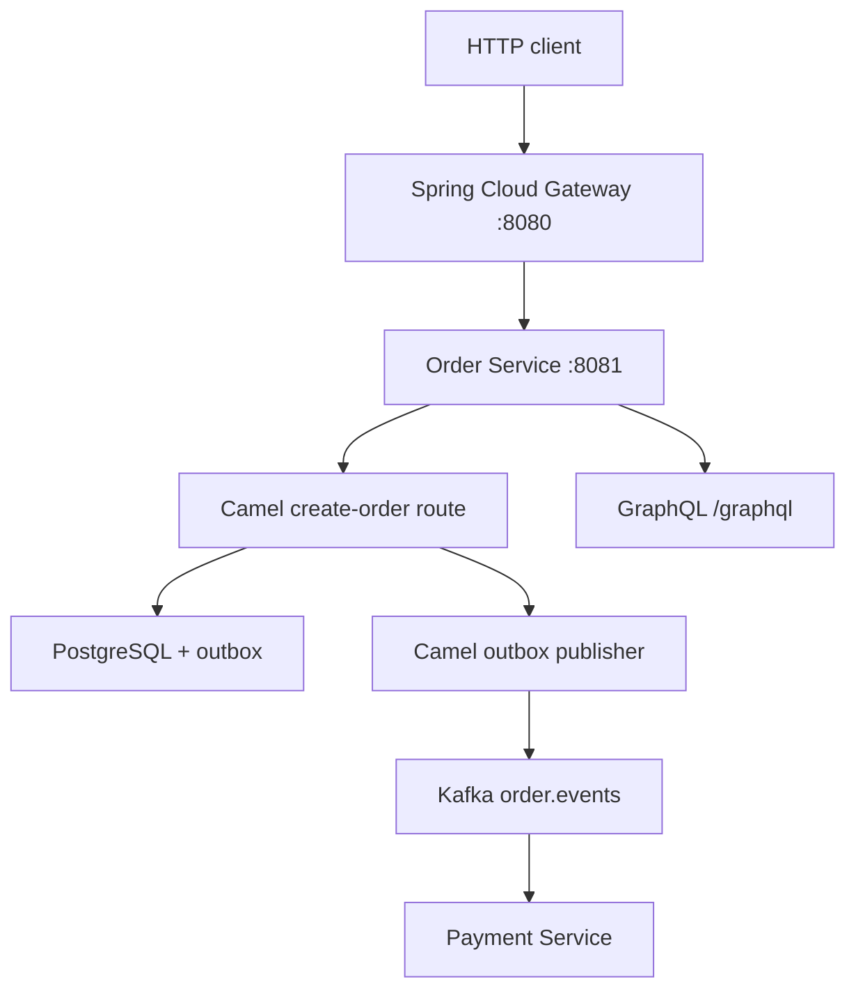

# FlowForge Order Orchestration

Java 21 / Spring Boot platform that creates orders over REST, validates and routes them with Apache Camel, stores them in PostgreSQL, publishes `ORDER_CREATED` to Kafka, and serves order status over GraphQL.



## What works today

1. `POST /api/orders` through the gateway or order-service
2. GraphQL `order(id)` for status and line items
3. Camel route that validates, persists, and queues `ORDER_CREATED`
4. Transactional outbox so the event is not lost if Kafka is briefly down
5. Payment service Kafka consumer (simulated authorization log)
6. PostgreSQL via Flyway
7. Swagger UI at `/swagger-ui.html`
8. Docker Compose for local execution

## Run locally

Start Postgres and Kafka, then the apps:

```bash
docker compose up postgres kafka -d
export JAVA_HOME="/opt/homebrew/opt/openjdk/libexec/openjdk.jdk/Contents/Home"
./mvnw -pl order-service,gateway,payment-service -am spring-boot:run
```

Or run everything in containers:

```bash
docker compose up --build
```

Gateway is on [http://localhost:8080](http://localhost:8080).

Create an order:

```bash
curl -sS -X POST http://localhost:8080/api/orders \
  -H 'Content-Type: application/json' \
  -d '{
    "customerId": "cust-42",
    "fulfillmentType": "PHYSICAL",
    "currency": "USD",
    "items": [{ "sku": "SKU-100", "quantity": 2, "unitPrice": 19.99 }]
  }'
```

Query it with GraphQL:

```bash
curl -sS http://localhost:8080/graphql \
  -H 'Content-Type: application/json' \
  -d '{"query":"query($id:ID!){ order(id:$id){ id status customerId totalAmount items { sku quantity } } }","variables":{"id":"ORDER_ID"}}'
```

Docs:

- Swagger UI: http://localhost:8080/swagger-ui.html
- GraphiQL: http://localhost:8080/graphiql

## Tests

```bash
export JAVA_HOME="/opt/homebrew/opt/openjdk/libexec/openjdk.jdk/Contents/Home"
./mvnw -pl order-service test
```

The integration test uses Testcontainers PostgreSQL and asserts REST create + GraphQL query + outbox `ORDER_CREATED`.

## Next (day 2+)

- Payment/shipment events that advance order status
- Next.js dashboard
- OpenTelemetry traces (Jaeger, then Dynatrace)
- ECS/Fargate deploy
