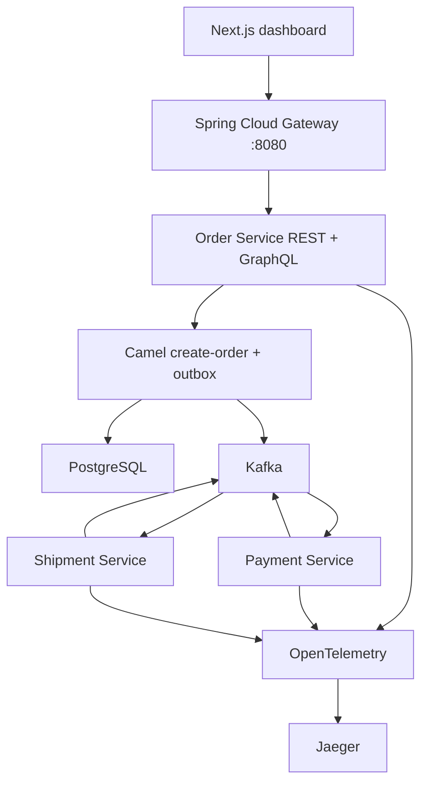

# FlowForge — Cloud-Native Order Orchestration

Java 21 platform that takes an order, validates it with **Apache Camel**, stores it in **PostgreSQL**, emits Kafka events, and moves it through payment and shipment until it is `SHIPPED`. Recruiters can click the demo, place an order, and watch the timeline fill in.

**[Live dashboard](https://flowforge-order-orchestration.vercel.app)** · **[Source](https://github.com/Plk-g/flowforge-order-orchestration)**

The hosted dashboard is an interactive preview of the same UI. The full Java / Kafka / Postgres / Jaeger stack is one Docker Compose command.

## What works

| Capability | Where to see it |
|---|---|
| `POST /api/orders` | Dashboard button or Swagger |
| GraphQL `order(id)` with timeline | Dashboard polling + GraphiQL |
| Camel `direct:createOrder` validation | Order service logs + timeline `VALIDATED` |
| `ORDER_CREATED` outbox → Kafka | Payment service log |
| Payment consumer → `PAYMENT_COMPLETED` | Status becomes `PAID` |
| Shipment consumer → `SHIPMENT_COMPLETED` | Status becomes `SHIPPED` |
| PostgreSQL + Flyway | `orders`, `order_outbox`, `order_timeline` |
| OpenAPI | http://localhost:8080/swagger-ui.html |
| OpenTelemetry traces | http://localhost:16686 |
| Docker Compose | `docker compose up --build` |
| CI | GitHub Actions on `main` |

## Architecture



Saga: `CREATED → VALIDATED → PAYMENT_PENDING → PAID → SHIPMENT_PENDING → SHIPPED`  
Digital orders skip the warehouse step after payment.

## Quick start (full stack)

```bash
export JAVA_HOME="/opt/homebrew/opt/openjdk/libexec/openjdk.jdk/Contents/Home"
docker compose up --build
```

Then open:

- Dashboard: http://localhost:3000
- Gateway API: http://localhost:8080
- Swagger: http://localhost:8080/swagger-ui.html
- GraphiQL: http://localhost:8080/graphiql
- Jaeger: http://localhost:16686

```bash
curl -sS -X POST http://localhost:8080/api/orders \
  -H 'Content-Type: application/json' \
  -d '{
    "customerId": "cust-42",
    "fulfillmentType": "PHYSICAL",
    "items": [{ "sku": "SKU-100", "quantity": 2, "unitPrice": 19.99 }]
  }'
```

Wait a few seconds, then query GraphQL — status should be `SHIPPED`.

## Tests

```bash
./mvnw -pl order-service -am test
```

## Resume bullet (accurate)

**Cloud-Native Order Orchestration Platform** | Java 21, Spring Boot, Spring Cloud Gateway, Apache Camel, GraphQL, Kafka, PostgreSQL, Docker, OpenTelemetry  
Built a distributed order-processing platform with REST writes, GraphQL reads, Camel validation/outbox routing, and Kafka consumers for payment and shipment. Containerized the stack with Docker Compose, added searchable traces in Jaeger, and shipped a Next.js operations dashboard.

Do **not** list ECS/Fargate or Dynatrace until those are actually running. Starter Fargate task JSON lives in `deploy/ecs/`.
